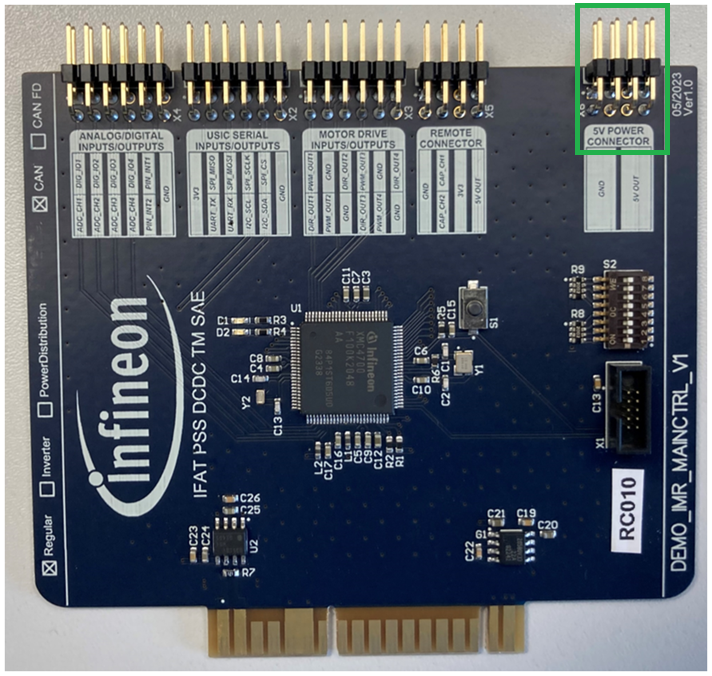

<!--
SPDX-FileCopyrightText: Copyright (c) 2024 Infineon Technologies AG
SPDX-License-Identifier: MIT
-->

# IMR Software for XMC4700 Main / Robot Control 

 
 

## Overview

This is the official Infineon GitHub repository for ModusToolbox™ software used with the demo board for IMR main / robot control.

The IMR main / robot control is responsible for receiving, modifying and  forwarding commands. Its main purpose is to calculate a trajectroy command "(vx,vy,theta)" into the relative motor speeds and sending them to the <a href="https://github.com/Infineon/IMR_IMD701_MC">IMR motor control</a> boards.

Furthermore, using an external <a href="https://www.frsky-rc.com/product/xm-plus/">SBUS receiver</a> connected to the main / robot control allows one to directly control the IMR using the following commands:
 
 

<table style="width:100%">
  <tr>
    <th>SBUS-Channel</th>
    <th>RC Input</th>
    <th>IMR Action</th>
  </tr>
  <tr>
    <td>0</td>
    <td>Left-Stick Up/Down</td>
    <td>NOP</td>
  </tr>
  <tr>
    <td>1</td>
    <td>Right-Stick Left/Right</td>
    <td>move Left/Right</td>
  </tr>
  <tr>
    <td>2</td>
    <td>Right-Stick Up/Down</td>
    <td>move Forward/Backward</td>
  </tr>
  <tr>
    <td>3</td>
    <td>Left-Stick Left/Right</td>
    <td>rotate CCW/CW</td>
  </tr>
  <tr>
    <td>4</td>
    <td>2-state shoulder SW</td>
    <td>en/disable RC control</td>
  </tr>
  <tr>
    <td>5</td>
    <td>3-state SW Left</td>
    <td>IMR LED Command</td>
  </tr>
  <tr>
    <td>6</td>
    <td>3-state SW Right</td>
    <td>IMR LED Color</td>
  </tr>
  <tr>
    <td>...</td>
    <td>NOT USED</td>
    <td>NOP</td>
  </tr>
</table>

### Features

- 3.3 V 32-bit microcontroller Arm® Cortex®-M4 144 MHz XMC4700 with 2 MB Flash and 352 kB RAM
- CAN bus communication with onboard CAN transceiver
- Onboard linear voltage regulator with 5 V input and 3.3 V output up to 0.5 A
- Onboard DIP switch for unique board identification
- Peripherals available for external use: 4x ADC, UART, I2C, SPI, 4x GPIO, 2x Event Request Unit (ERU) capable IO, 4x PWM and direction input, 2x PWM capture input
- Power available for external use: 5 V and 3.3 V
- Inverse kinematics function to translate the required velocity to speed of 4x mecanum wheels
- Odometry estimation based on speed input from angle sensor encoder <a href="https://www.infineon.com/cms/en/product/sensor/magnetic-sensors/magnetic-position-sensors/angle-sensors/tli5012b-e1000/">TLI5012B E1000</a>

### Reference hardware

This software is meant to run on following reference hardware:

- <a href="https://www.infineon.com/cms/en/product/evaluation-boards/demo_imr_mainctrl_v1/">DEMO_IMR_MAINCTRL_V1 - Demo board for IMR main / robot control</a>

#### Featured Infineon Products 

Following products are featured by the reference hardware:
 
 
<table style="width:100%">
  <tr>
    <th>Product</th>
    <th>Description</th>
  </tr>
  <tr>
    <td><a href="https://www.infineon.com/cms/en/product/microcontroller/32-bit-industrial-microcontroller-based-on-arm-cortex-m/32-bit-xmc4000-industrial-microcontroller-arm-cortex-m4/xmc4700-f100k2048-aa/">XMC4700-F100K2048 AA</a></td>
    <td>High performance microcontroller with DSP and FPU capabilities</td>
  </tr>
  <tr>
    <td><a href="https://www.infineon.com/cms/en/product/transceivers/automotive-transceiver/automotive-can-transceivers/tle9351bvsj/">TLE9351BVSJ</a></td>
    <td>High speed CAN transceiver for CAN and CAN FD</td>
  </tr>
  <tr>
    <td><a href="https://www.infineon.com/cms/en/product/power/power-supply-ics/linear-voltage-regulators-for-automotive-applications/tls205b0ej-v33/?redirId=292125">TLS205B0EJ V33</a></td>
    <td>Micro power, low noise low dropout voltage regulator with current output up to 500 mA</td>
  </tr>
</table>

 

## Getting started

### How to import and use this repository
<ol>
<li> Install and start ModusToolbox™ and select a workspace to be used (tested with Version 3.3, and 3.4).
<li> Import the project with the import wizard by pressing 'File' – 'Import…'.  
    <picture>
        
    </picture>
     
    &nbsp;
</li>
<li> Select 'ModusToolbox™' – 'Import Existing Application In-Place' and press 'Next'.   
    <picture>
        
    </picture>
     
    &nbsp;
</li>
<li> Find the Project Location by pressing 'Browse…'.   
    <picture>
        
    </picture>
     
    &nbsp;
</li>
<li> Select the project folder accordingly and press 'Finish'.   
    <picture>
        
    </picture>
     
    &nbsp;
</li>
<li> Wait until the project is fully imported.   
    <picture>
        
    </picture>
     
    &nbsp;
</li>
<li> Notice that additional folder 'mtb_shared' should be created (if there was none) when the import is completed.   
    <picture>
        
    </picture>
     
    &nbsp;
</li>
<li> Right click the project folder and select 'ModusToolbox™' followed by 'Library Manager 2...'.   
    <picture>
        
    </picture>
     
    &nbsp;
</li>
<li> Press the 'Update' button   
    <picture>
        
    </picture>
     
    &nbsp;
</li>
<li> When the Update is completed the sucessful messages should be displayed. If the update failed, try it again by repressing the 'Update' button. If this also fails try to clean the project, before trying it again.   
    <picture>
        
    </picture>
     
    &nbsp;
</li>
<li> Before building the project it is recommended to clean it by pressing 'Clean Application'.   
    <picture>
        
    </picture>
     
    &nbsp;
</li>
<li> Finally the project can be compiled by pressing 'Build Application'.   
    <picture>
        
    </picture>
     
    &nbsp;
</li>
<li> Before flashing the project onto the board, connect the XMC™ Link Programming adapter using the 10-pin flat cable and <a href="./assets/DEMO_IMR_PROGADPTR_V1@e7eacb3013a-zip">the programming adapter</a> to provide power to the board. If the programming adapter is not available, connect external power supply to the 5V and GND pins of X6 connector onboard.   
	<picture>
        
    </picture>
     
	<picture>
        
    </picture>
     
    &nbsp;
</li>
<li> Finally to flash the project onto the board, use the green play button in ModusToolbox™ on the bottom left - 'Quick Panel' - 'Launches' - 'IMR_XMC4700_RC Program (JLink)' to initiate the process.  
	<picture>
        
    </picture>
     
    &nbsp;
</li>
</ol>

## Additional information

Precise definition of the software and its features can be found in the close-to-code documentation on top of each file, at the specific function itself and in the software documentation.

### Related resources

- [Robotics development platform: Infineon Mobile Robot (IMR)](https://www.infineon.com/cms/de/applications/robotics/development-platform/)
- [IMR motor control](https://www.infineon.com/cms/en/product/evaluation-boards/demo_imr_mtrctrl_v1/)
- [IMR motor position angle sensor](https://www.infineon.com/cms/en/product/evaluation-boards/demo_imr_angle_sens_v1/)

### Licensing

Please see our [LICENSE](LICENSE) for copyright and license information.
